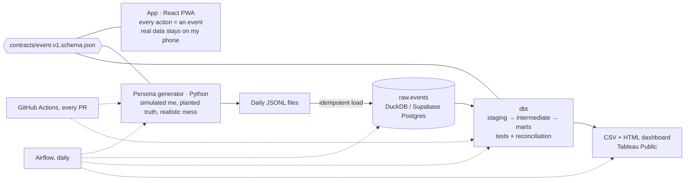

# Priority Matrix

**An Eisenhower Matrix + Pomodoro app that records how I actually prioritize, and the data
pipeline that analyzes it.**

**Live app:** https://task-priority-tracker.netlify.app · **Case study:** [docs/case-study.md](docs/case-study.md)

I suspected two things about how I work: that urgent-important tasks eat the focus meant for
important-not-urgent ones, and that much of what I label "urgent" stops being urgent within days.
This repo is the app that records the evidence and the pipeline that tests it.



## What's here

| Folder | What it is |
|---|---|
| [`app/`](app/) | The web app (React + Vite). Installable on a phone, works offline, no account; data stays in the browser. Every action is logged as an event. |
| [`contracts/`](contracts/) | The event format as JSON Schema: the contract between app, generator and warehouse ([docs](docs/event-schema.md)). |
| [`generator/`](generator/) | "Medha (simulated)": a day-by-day simulation of my routine with both hypotheses planted, realistic data problems injected and counted, and an answer key. 80 tests. |
| [`warehouse/`](warehouse/) + [`dbt/`](dbt/) | Loader, dbt project (DuckDB locally, Postgres/Supabase in production), 54 tests including reconciliation against the answer key. |
| [`airflow/`](airflow/) | Daily DAG: generate → load → dbt seed/run/test → export (→ weekly review). |
| [`review/`](review/) | Optional weekly review: numbers from SQL, short commentary from Claude. |
| [`supabase/`](supabase/) | SQL to create the warehouse schemas on Supabase, locked away from the public API. |
| [`docs/`](docs/) | [Case study](docs/case-study.md), [event schema](docs/event-schema.md), [dashboard guide](docs/dashboard.md). |
| [`design/`](design/) | Design directions and mockups. |

## Findings (synthetic data, Jun 10 – Oct 8)

- **Do first gets 52% of focus time but is 14% of the to-do list: 3.6× its share.**
  Schedule is 55% of the list and gets 28% of focus.
- **62% of urgent tasks still open the next morning were later downgraded**, at a median of
  1.0 day. Most lose their urgency at the very first morning review.

## Run it

```bash
# App
cd app && npm install && npm run dev

# Generator (Python 3.9+)
python3 -m venv generator/.venv && generator/.venv/bin/pip install -r generator/requirements-dev.txt -e generator
generator/.venv/bin/pytest generator -q

# Warehouse + dbt: generate → load → build and test everything (DuckDB, no server)
python3 -m venv warehouse/.venv && warehouse/.venv/bin/pip install -r warehouse/requirements.txt
./warehouse/run_pipeline.sh
warehouse/.venv/bin/python warehouse/export.py && warehouse/.venv/bin/python warehouse/build_dashboard.py
open exports/dashboard.html
```

Airflow and Supabase setup: [airflow/README.md](airflow/README.md), [warehouse/README.md](warehouse/README.md).

## Privacy

The app has no backend: my real tasks never leave my device unless I export them. Everything
public here (dataset, warehouse, dashboard) is generated by the simulation.
