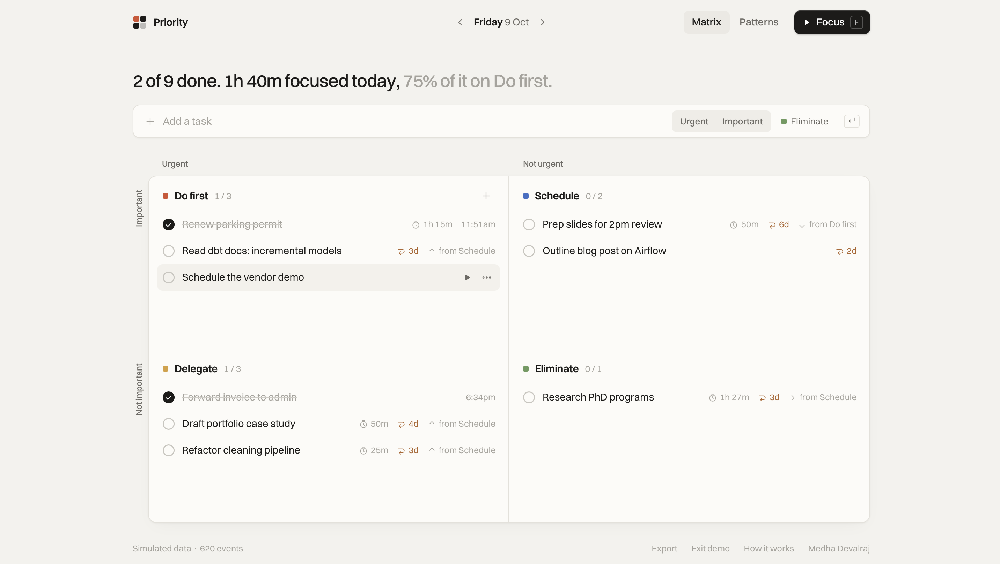
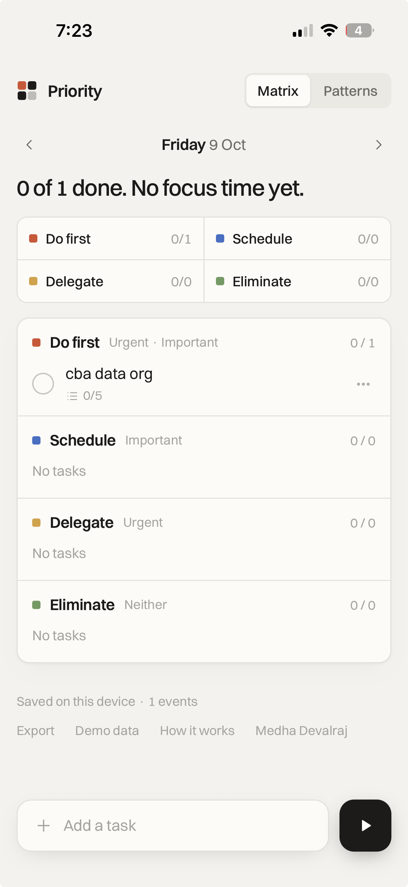
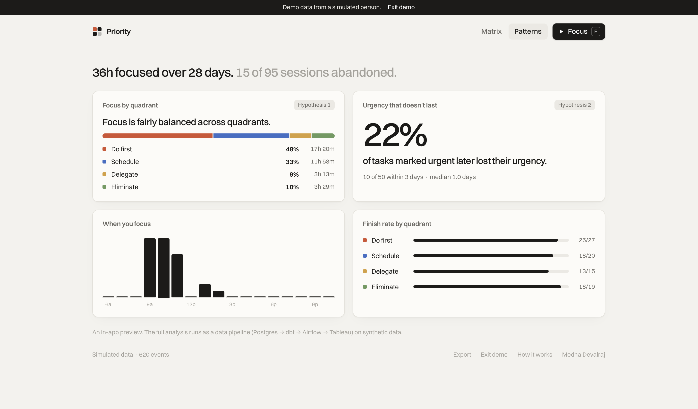
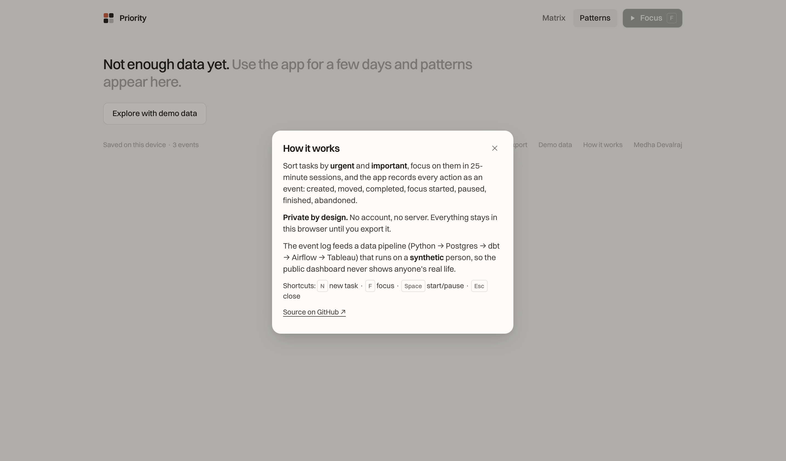
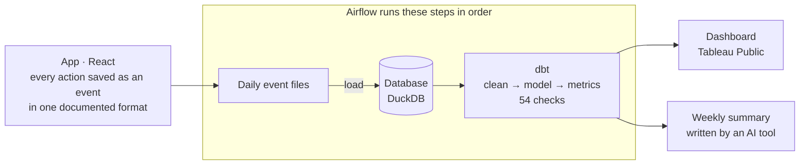

# Priority Matrix

A to-do app that shows where your focus actually goes, and the data pipeline behind it.

**Live app:** https://task-priority-tracker.netlify.app · [open with demo data](https://task-priority-tracker.netlify.app/?demo) · **[Case study](docs/case-study.md)**

<p>
  
  &nbsp;
  
</p>
<p>
  
  &nbsp;
  
</p>

## What the app does

- **Matrix:** sort tasks into four boxes by urgent and important: Do first, Schedule,
  Delegate, Eliminate. Unfinished tasks carry over to the next day.
- **Focus:** work on a task in 25-minute sessions (Pomodoro), with pause and resume.
- **Patterns:** see where your focus time went, and how often "urgent" tasks were downgraded
  a few days later.
- **Private:** no account and no server. Data stays on your device; export it any time.
  Installable on a phone and works offline.

Every action (task created, moved, finished, focus started, paused, abandoned) is saved as an
event. That history is what makes the analysis possible.

## The data pipeline



1. **Source:** the app's event log, in a documented format ([data contract](docs/event-schema.md)).
2. **Load:** events go into a database, one day at a time.
3. **Clean:** duplicates removed, bad timestamps repaired, broken rows set aside and counted.
4. **Model:** SQL (dbt) turns events into metrics with written definitions, and 54 checks
   confirm the numbers are right.
5. **Report:** the metrics are exported for the dashboard. An AI tool writes a short weekly
   summary from them.

Airflow runs these steps in order, and GitHub Actions re-runs every check when the code
changes.

> **Note:** for privacy, the data in this repo is synthetic, in the same format as the app's own
> data.

## Folders

| Folder | |
|---|---|
| [`app/`](app/) | The app (React) |
| [`generator/`](generator/) | Synthetic data in the app's format |
| [`warehouse/`](warehouse/) | Loading, export and the weekly summary |
| [`dbt/`](dbt/) | Cleaning, metric definitions and checks (SQL) |
| [`airflow/`](airflow/) | The pipeline steps as a workflow |
| [`docs/`](docs/) | [Case study](docs/case-study.md), [data contract](docs/event-schema.md), design work |

## Run it

The app:

```bash
cd app && npm install && npm run dev
```

The pipeline:

```bash
python3 -m venv generator/.venv && generator/.venv/bin/pip install -U pip && generator/.venv/bin/pip install -e generator
python3 -m venv warehouse/.venv && warehouse/.venv/bin/pip install -U pip && warehouse/.venv/bin/pip install -r warehouse/requirements.txt
./warehouse/run_pipeline.sh
```

More in [warehouse/README.md](warehouse/README.md).
